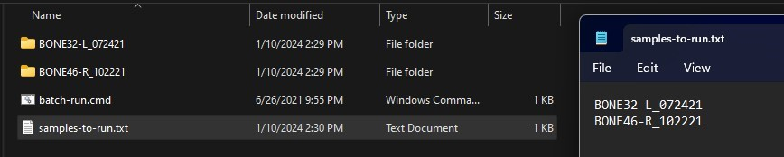

[🏠 < Home](https://github.com/ChelCarriere/photogrammetry-anthropology-tools)

# Batch-run cmd for Meshroom

## This comand allows the user to queue multiple and separate photosets for processing into 3D models in Meshroom

Edit **batch-run.cmd** and change the path in `set MESHROOM="D:\Program Files\Meshroom-2021.1.0-win64\Meshroom-2021.1.0\meshroom_batch.exe"` to reflect where Meshroom is installed on your system

In the same directory as you have the .cmd also place the _samples-to-run.txt_ file and any photoset directories you wish to process.

To select which photosets to process simply put the name of those directories into _samples-to-run_. **Please note that case matters**

Run the batch-run.cmd and wait for it to complete processing all of your samples

This will create a "model" folder in each photoset directories and the final textured meshes can be found "\model\MeshroomCache\Texturing\6343103540db91e7fe29a5b32b0da6831c9b3bcd\texturedMesh.obj"