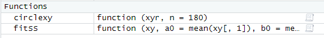
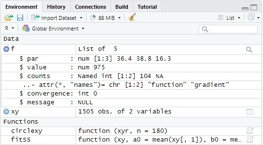
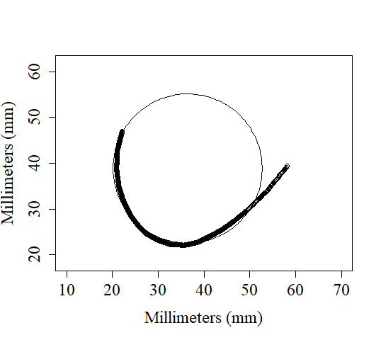

[🏠 < Home](https://github.com/ChelCarriere/photogrammetry-anthropology-tools)

# Creating a Best-Fit Circle from curve data

The xy coordinates of the curve (.csv file) can be brought into RStudio and a best-fit circle can be computed using the least squares method. 

First import the dataset and name it "xy"

Add the functions "fitSS" and "circlexy" by copy/pasting them into the console individually and hitting enter. If done correctly you should see this in the environment: 

---
To compute the circle parameters type "f=fitSS(xy)" into the console. This will create Data "f" in the environemnt: 

The $par value is a vector of xcenter, ycenter, radius in that order.

---
To plot the curve and computed circle use the "plot" and "lines" comands with appropriate values. 

